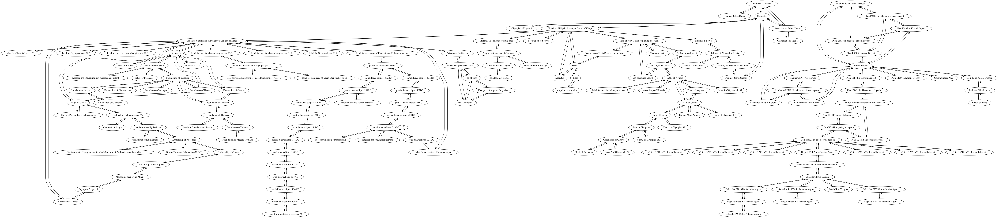

# clas267

This repository hosts chronological graphs built as part of course projects in CLAS267, "Archaeology and Time," at Holy Cross in the spring semester of 2017.

(All images on these pages are linked to the full source image in this repository: click to follow the link.)

## What we did

TBA : link to brief description of project modelling evidence for chronology.

## What's here

- collected data sets:
    - catalogs of events
    - formal models of synchronisms
- for each project, visualizations and automated summaries of shortest paths from a given event to the epoch of Nabonasar (747 BCE).  See links to individual projects below.
- source code for all software used in this project

## Individual projects

- [Battle of Actium](projects/actium.md) (Julia Spiegel and Mark Vanderploeg)
- Lunar eclipses in Ptolemy's *Almagest* (Mary Patrice Hamilton and Anthony Criscitiello)
- Eruption of Vesuvius (Joe Aramini)
- Destruction of the Library of Alexandria (Nora Cowherd)
- Sack of Carthage (Jeffrey Dickinson)
- Tomb 2 at Vergina (Amanda Kondek)
- Foundation of selected colonies in Sicily (Kelsey Littlefield)
- First Olympic games (Stephanie Neville)
- The plague in Athens (Myles O'Brien)
- Death of Julius Caesar (Stephen Paganelli)
- Caesar and Cleopatra (Siobhan Plummer)
- Sicilian colonization (Zak Jung and Jack Skinner)
- Outbreak of the Peloponnesian war (Blake Werab)

## How to use the included scripts

See [these notes](./generate-how-to.md)
