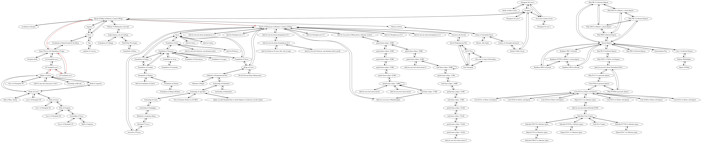

## Battle of Actium

### Individual project network

### Shortest path to epoch of Nabonassar (747 BCE)

Path highlighted in red in

        Interval from Battle of Actium to Epoch of Nabonassar in Ptolemy’s Canon of Kings
        TOTAL CONNECTIONS: 5

        Battle of Actium -> 187 olympiad year 4
        quantity: 0
        For category years, Contemporary, amount 0

        187 olympiad year 4 -> 218 olympiad year 4
        quantity: -31
        For category Olympiads, Precedes, amount -31

        218 olympiad year 4 -> End of Nervas rule beginning of Trajan
        quantity: 0
        For category years, Contemporary by 0
        New total: 0

        End of Nervas rule beginning of Trajan -> Epoch of Philip in Ptolemy's Canon of Kings
        quantity: 439
        For category years, Follows by 439
        New total: 439

        Epoch of Philip in Ptolemy Canon of Kings -> Epoch of Nabonassar in Ptolemy Canon of Kings
        quantity: 424
        For category years, Follows by 424
        New total: 863

        Interval from Battle of Actium to Epoch of Nabonassar in Ptolemy’s Cannon of Kings
        Total:
        years: 863
        olympiads: -31
