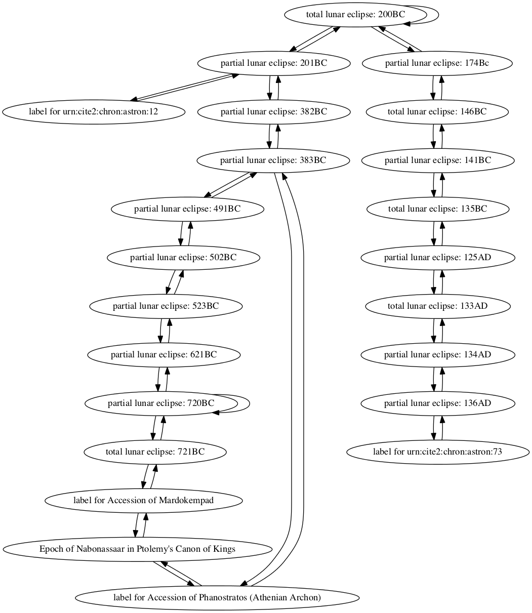
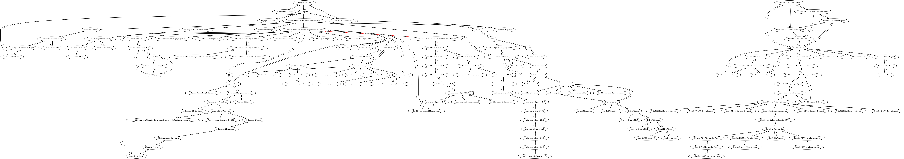

## Lunar eclipse of 383 BCE

Mary Patrice Hamilton, Anthony Criscitiello

### Individual project network

### Shortest path to epoch of Nabonassar (747 BCE)

Path highlighted in red in

        Sum interval from partial lunar eclipse: 383BCE to Epoch of Nabonassaar in Ptolemy's Canon of Kings
        TOTAL CONNECTIONS: 2

        partial lunar eclipse: 383BC -> label for Accession of Phanostratos (Athenian Archon)
        quantity: 0
        For category years, create entry for contemporary, amount 0

        label for Accession of Phanostratos (Athenian Archon) -> Epoch of Nabonassaar in Ptolemy's Canon of Kings
        quantity: 366
        For category years, modifying total with relation follows by 366
        New total: 366

        Interval from partial lunar eclipse: 383BC to Epoch of Nabonassaar in Ptolemy's Canon of Kings
        Total:
        years: 366
