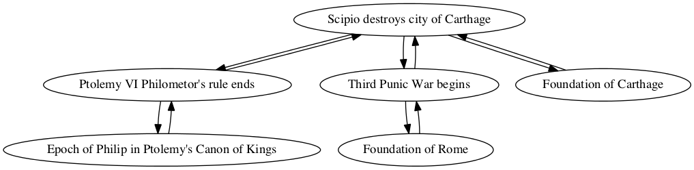
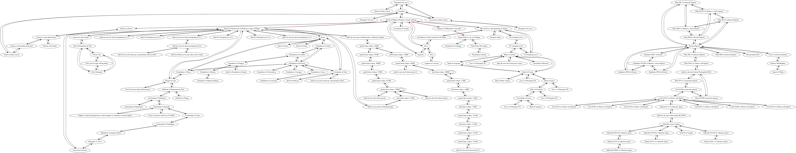

## Sack of Carthage

Jeffrey Dickinson

### Individual project network

### Shortest path to epoch of Nabonassar (747 BCE)

Path highlighted in red in

        Sum interval from Scipio destroys city of Carthage to Epoch of Nabonassaar in Ptolemy's Canon of Kings
        TOTAL CONNECTIONS: 3

        Scipio destroys city of Carthage -> Ptolemy VI Philometor's rule ends
        quantity: 0
        For category relative, create entry for precedes, amount 0

        Ptolemy VI Philometor's rule ends -> Epoch of Philip in Ptolemy's Canon of Kings
        quantity: 178
        For category year, create entry for follows, amount 178

        Epoch of Philip in Ptolemy's Canon of Kings -> Epoch of Nabonassaar in Ptolemy's Canon of Kings
        quantity: 424
        For category years, create entry for Follows, amount 424

        Interval from Scipio destroys city of Carthage to Epoch of Nabonassaar in Ptolemy's Canon of Kings
        Total:
        relative: 0
        year: 178
        years: 424
