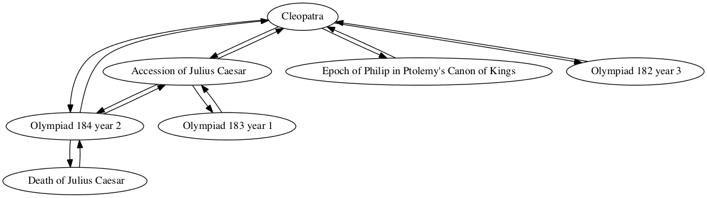
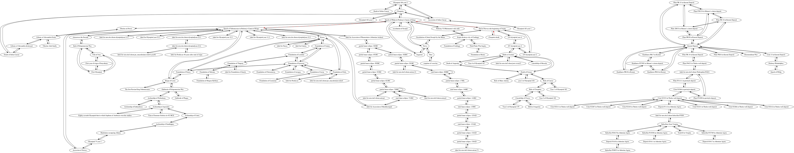

## Death of Cleopatra

Siobhan Plummer

### Individual project network

### Shortest path to epoch of Nabonassar (747 BCE)

Path highlighted in red in

        Sum interval from Cleopatra death to Epoch of Nabonassaar in Ptolemy's Canon of Kings
        TOTAL CONNECTIONS: 3

        Cleopatra death -> End of Nervas rule beginning of Trajan
        quantity: -128
        For category years, Precedes, amount -128

        End of Nervas rule beginning of Trajan -> Epoch of Philip in Ptolemy's Canon of Kings
        quantity: 439
        For category years, Follows by 439
        New total: 311

        Epoch of Philip in Ptolemy's Canon of Kings -> Epoch of Nabonassaar in Ptolemy's Canon of Kings
        quantity: 424
        For category years, Follows by 424
        New total: 735

        Interval from Cleopatra death to Epoch of Nabonassaar in Ptolemy's Canon of Kings
        Total:
        years: 735
