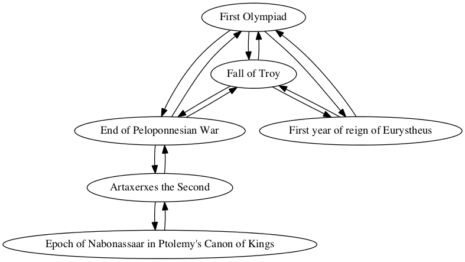
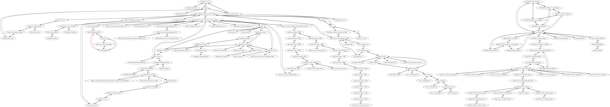

## First Olympiad

Stephanie Neville

### Individual project network

### Shortest path to epoch of Nabonassar (747 BCE)

Path highlighted in red in

        Sum interval from First Olympiad to Epoch of Nabonassaar in Ptolemy's Canon of Kings
        TOTAL CONNECTIONS: 3

        First Olympiad -> End of Peloponnesian War
        quantity: -377
        For category years, precedes, amount -377

        End of Peloponnesian War -> Artaxerxes the Second
        quantity: 0
        For category eponym, contemporary, amount 0

        Artaxerxes the Second -> Epoch of Nabonassaar in Ptolemy's Canon of Kings
        quantity: 389
        For category years, follows by 389
        New total: 12

        Interval from First Olympiad to Epoch of Nabonassaar in Ptolemy's Canon of Kings
        Total:
        years: 12
        eponym: 0
