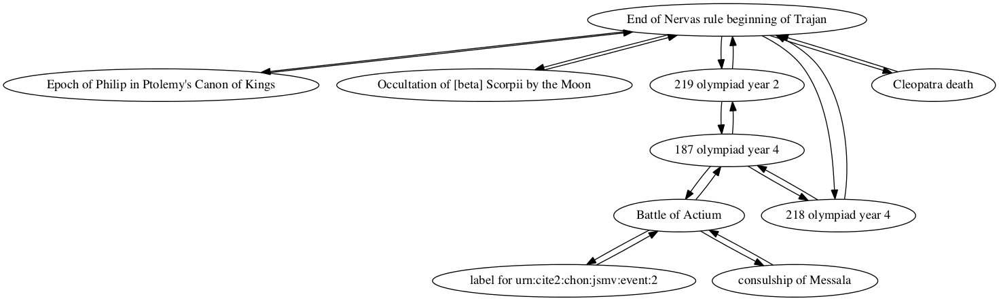

## Selected Sicilian colonial foundations

Kelsey Littlefield

### Individual project network

### Shortest path from foundation of Gela to epoch of Nabonassar (747 BCE)

Path highlighted in red in

        Sum interval from Foundation of Gela to Epoch of Nabonassaar in Ptolemy's Canon of Kings
        TOTAL CONNECTIONS: 2

        Foundation of Gela -> Kyros
        quantity: -161
        For category eponym, precedes, amount -161

        Kyros -> Epoch of Nabonassaar in Ptolemy's Canon of Kings
        quantity: 209
        For category years, follows, amount 209

        Interval from Foundation of Gela to Epoch of Nabonassaar in Ptolemy's Canon of Kings
        Total:
        eponym: -161
        years: 209
