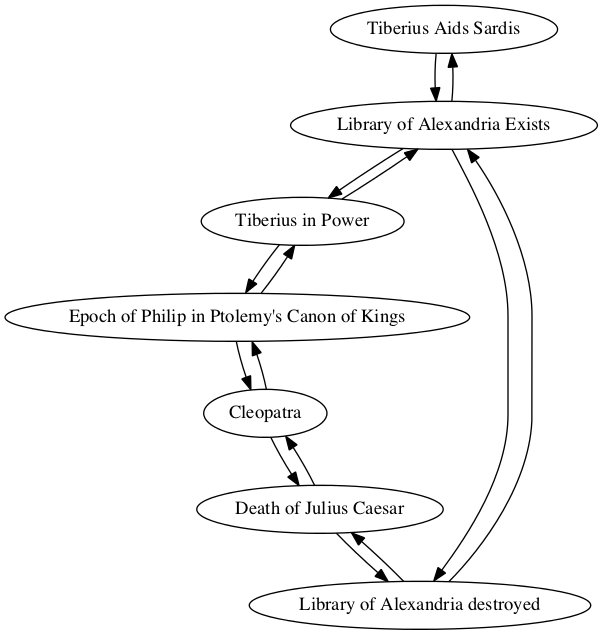
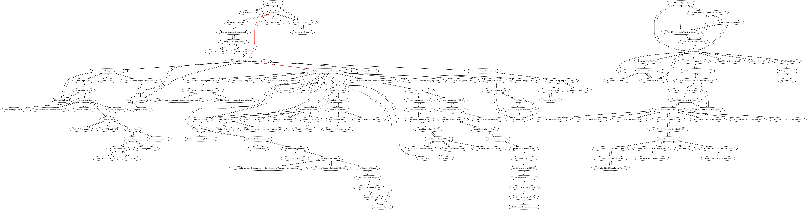

## Destruction of the Library of Alexandria

Nora Cowherd

### Individual project network

### Shortest path to epoch of Nabonassar (747 BCE)

Path highlighted in red in

        Sum interval from Library of Alexandria destroyed to Epoch of Nabonassaar in Ptolemy's Canon of Kings
        TOTAL CONNECTIONS: 4

        Library of Alexandria destroyed -> Death of Julius Caesar
        quantity: 0
        For category Relative, Precedes, amount 0

        Death of Julius Caesar -> Cleopatra
        quantity: 7
        For category years, follows, amount 7

        Cleopatra -> Epoch of Philip in Ptolemy's Canon of Kings
        quantity: 272
        For category Years, Follows by 272
        New total: 279

        Epoch of Philip in Ptolemy's Canon of Kings -> Epoch of Nabonassaar in Ptolemy's Canon of Kings
        quantity: 424
        For category years, Follows by 424
        New total: 703

        Interval from Library of Alexandria destroyed to Epoch of Nabonassaar in Ptolemy's Canon of Kings
        Total:
        relative: 0
        years: 703
