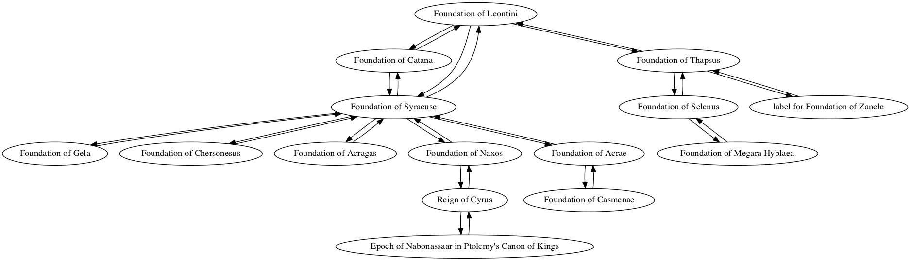
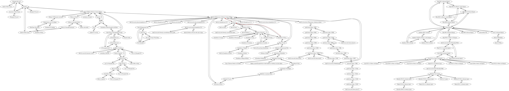

## Sicilian colonization

Zak Jung and Jack Skinner

### Individual project network

### Shortest path to epoch of Nabonassar (747 BCE)

Path highlighted in red in

        Sum interval from Foundation of Naxos to Epoch of Nabonassaar in Ptolemy's Canon of Kings
        TOTAL CONNECTIONS: 2

        Foundation of Naxos -> Reign of Cyrus
        quantity: -180
        For category Year, Precedes, amount -180

        Reign of Cyrus -> Epoch of Nabonassaar in Ptolemy's Canon of Kings
        quantity: 209
        For category Year, Follows by 209
        New total: 29

        Interval from Foundation of Naxos to Epoch of Nabonassaar in Ptolemy's Canon of Kings
        Total:
        year: 29
