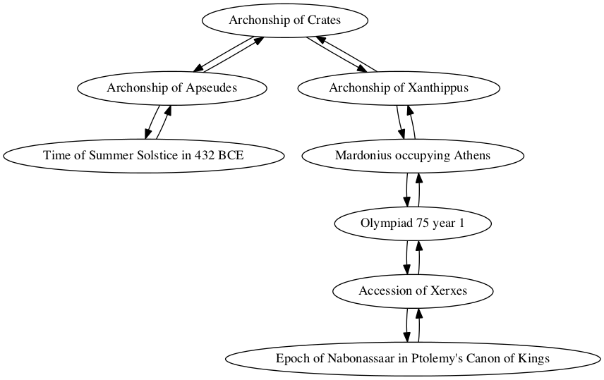
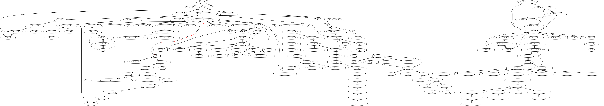

## Outbreak of the Peloponnesian War

Blake Werab

### Individual project network

### Shortest path to epoch of Nabonassar (747 BCE)

Path highlighted in red in

        Sum interval from Outbreak of Peloponnesian War to Epoch of Nabonassaar in Ptolemy's Canon of Kings
        TOTAL CONNECTIONS: 2

        Outbreak of Peloponnesian War -> Reign of Cyrus
        quantity: 0
        For category year, create entry for contemporary, amount 0

        Reign of Cyrus -> Epoch of Nabonassaar in Ptolemy's Canon of Kings
        quantity: 209
        For category Year, modifying total with relation Follows by 209
        New total: 209

        Interval from Outbreak of Peloponnesian War to Epoch of Nabonassaar in Ptolemy's Canon of Kings
        Total:
        year: 209
