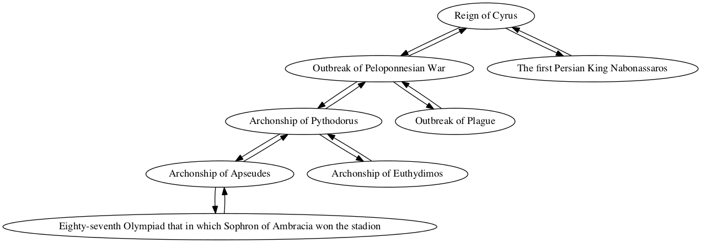
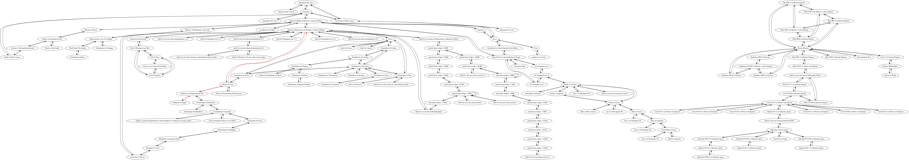

## Plague in Athens

Myles O'Brien

### Individual project network

### Shortest path to epoch of Nabonassar (747 BCE)

Path highlighted in red in

        Sum interval from Outbreak of Plague to Epoch of Nabonassaar in Ptolemy's Canon of Kings
        TOTAL CONNECTIONS: 3

        Outbreak of Plague -> Outbreak of Peloponnesian War
        quantity: 0
        For category year, create entry for Contemporary, amount 0

        Outbreak of Peloponnesian War -> Reign of Cyrus
        quantity: 0
        For category year, modifying total with relation contemporary by 0
        New total: 0

        Reign of Cyrus -> Epoch of Nabonassaar in Ptolemy's Canon of Kings
        quantity: 209
        For category Year, modifying total with relation Follows by 209
        New total: 209

        Interval from Outbreak of Plague to Epoch of Nabonassaar in Ptolemy's Canon of Kings
        Total:
        year: 209
