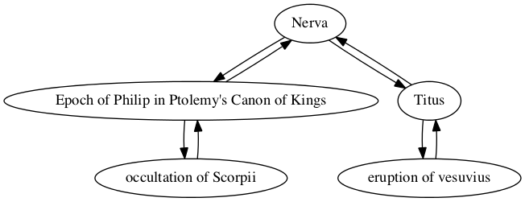
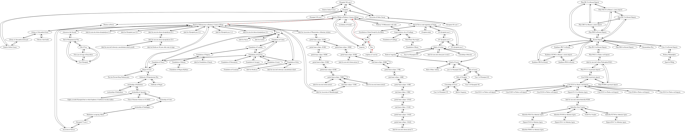

## Eruption of Vesuvius

Joe Aramini

### Individual project network

### Shortest path to epoch of Nabonassar (747 BCE)

Path highlighted in red in

        Sum interval from eruption of vesuvius to Epoch of Nabonassaar in Ptolemy's Canon of Kings
        TOTAL CONNECTIONS: 4

        eruption of vesuvius -> Titus
        quantity: 2
        For category years, follows, amount 2

        Titus -> Nerva
        quantity: -16
        For category years, precedes by -16
        New total: -14

        Nerva -> Epoch of Philip in Ptolemy's Canon of Kings
        quantity: 420
        For category years, follows by 420
        New total: 406

        Epoch of Philip in Ptolemy's Canon of Kings -> Epoch of Nabonassaar in Ptolemy's Canon of Kings
        quantity: 424
        For category years, Follows by 424
        New total: 830

        Interval from eruption of vesuvius to Epoch of Nabonassaar in Ptolemy's Canon of Kings
        Total:
        years: 830
